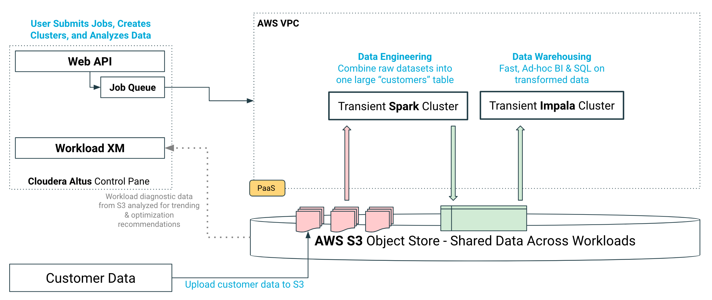
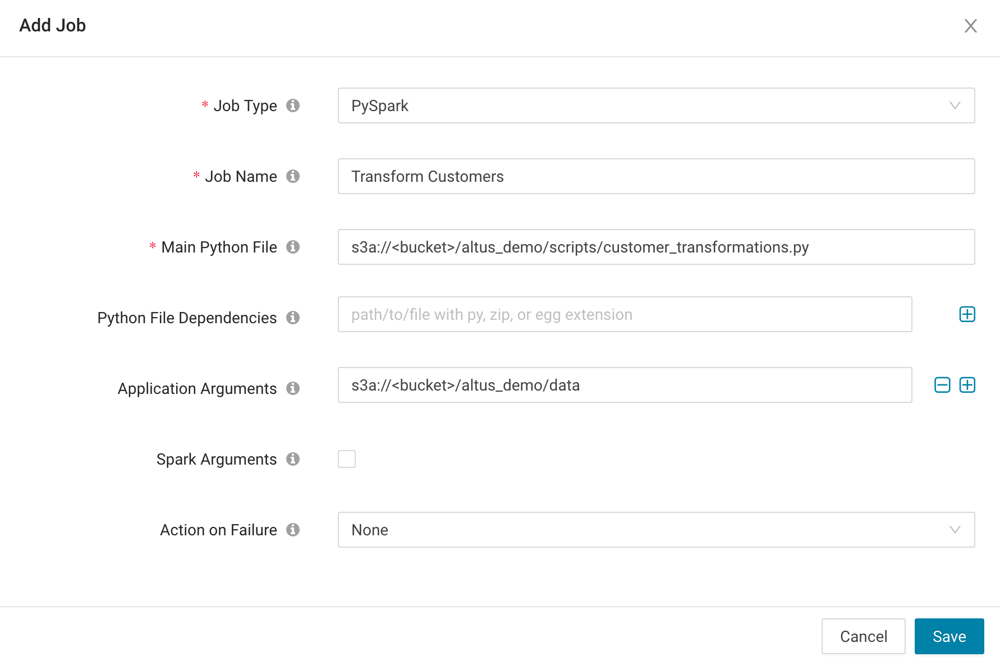
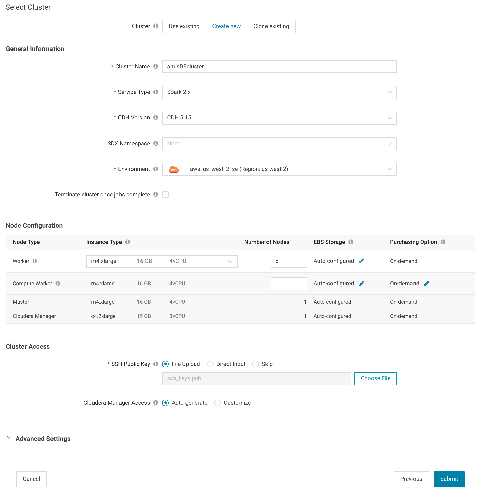

# Cloudera Altus Demo

This project demonstrates how to perform processing, analytics and machine learning
using Cloudera Altus. 

## Overview of Cloudera Altus
Cloudera Altus empowers data engineers to run data pipelines on exabytes of data in 
cloud storage. It delivers self-service data warehousing capabilities, so analysts 
can provide critical insights back to the business. SDX for Cloudera Altus makes 
it possible to persist and share data context such as table definitions, data security, 
and governance policies across long-running and transient cloud workloads. For more 
information on Cloudera Altus, visit Cloudera's [website](https://www.cloudera.com/products/altus.html)

This demo uses:
* [Altus Data Engineering](https://www.cloudera.com/products/altus/altus-data-engineering.html), a job-based managed service for creating and scaling data transformation pipelines
* [Altus Data Warehouse](https://www.cloudera.com/products/altus/altus-data-warehouse.html), a transient managed service for performing large-scale BI, reporting and ad-hoc analytics

## Demo Architecture


## Demo Steps
The demo uses [AWS](aws.amazon.com) as the underlying public cloud service. You 
will need an AWS account in order to run this demo. 

### Step 1: Setup Your Altus Environment
1. Register for a 30-day trial account on [Cloudera Altus](altus.cloudera.com). Detailed documentation can be found [here](https://www.cloudera.com/documentation/altus/topics/alt_gettingstarted.html#trial_get_started)
2. Create an Altus Environment on AWS using the [QuickStart Guide](https://www.cloudera.com/documentation/altus/topics/alt_env_setup_aws.html#env_wizard)
3. Download this Github repository onto your desktop and upload the folder into an [S3 Bucket in AWS](https://docs.aws.amazon.com/AmazonS3/latest/user-guide/upload-objects.html). 

### Step 2: Transform Data Using Altus Data Engineering
During the setup, you uploaded some [sample customer data](https://github.com/tomatoTomahto/altus_demo/tree/master/data) into AWS S3. 
In this step, we will run a transformation job on that data using Apache Spark. The 
script that does the transformations is also in S3, but you can view it [here](https://github.com/tomatoTomahto/altus_demo/blob/master/scripts/customer_transformations.py) 
for reference. 

We will submit the Spark Job directly to Cloudera Altus, which will run the job on a 
transient Cloudera Spark compute cluster in AWS.

1. In the Altus console, navigate to Data Engineering Jobs.
2. Create a new PySpark job in Altus using the "customer_transformations.py" script you uploaded to S3

3. In the next page, create a new Cloudera cluster to run the transformation job. Make sure you uncheck the box that tells Altus to terminate the cluster once the job completes. We will be re-using the cluster Altus creates to run more jobs.

4. Once the job runs, click the Analytics tab to view all the metrics that Altus tracks for your jobs
  * How many stages did Spark use to run the job?
  * How long did the job take to run?
  * How much input data did the job process?
  * How much output data did the job process?
5. Return to the Jobs pane and re-run the same job 4 times. You can do this by cloning the job and selecting the same cluster used previously. Make sure you keep the name of the job the same. 
6. After 4 runs of an identical job, Altus will create a baseline run for that job. Subsequent runs will be compared to the baseline. 
  * Make a duplicate of customer_info.csv and call it customer_info_dup.csv, and upload it to your data directory in S3
  * Re-run the job a 5th time. How does this affect the job run compared to the baseline? What metrics have changed?
7. Navigate to Data Engineering Clusters and terminate your cluster

### Step 3: Analyze the Transformed Data Using Altus Data Warehouse
Now that we have transformed our data and written the resulting dataset in S3, let's analyze it using ad-hoc SQL. 

We will use Apache Impala, an open source SQL engine that's designed for fast, ad-hoc
BI and analytics that's part of the Cloudera distribution. 

1. In the Altus console, navigate to Data Warehouse Clusters and create a new cluster.
2. Once the cluster is created, open the SQL Editor and create a table on the data in S3:
``` sql
CREATE DATABASE telco;
USE telco;

CREATE EXTERNAL TABLE telco.customers (
    id                      INT,
    state                   STRING,
    area_code               STRING,
    phone_number            STRING,
    intl_plan               BOOLEAN,
    voice_mail_plan         BOOLEAN,
    number_vmail_messages   DOUBLE,
    total_day_minutes       DOUBLE,
    total_day_calls         DOUBLE,
    total_day_charge        DOUBLE,
    total_eve_minutes       DOUBLE,
    total_eve_calls         DOUBLE,
    total_eve_charge        DOUBLE,
    total_night_minutes     DOUBLE,
    total_night_calls       DOUBLE,
    total_night_charge      DOUBLE,
    total_intl_minutes      DOUBLE,
    total_intl_calls        DOUBLE,
    total_intl_charge       DOUBLE,
    number_customer_service_calls   DOUBLE,
    account_length          DOUBLE,
    churned                 BOOLEAN
) STORED AS PARQUET
LOCATION 's3a://<bucket>/altus_demo/data/customers';
```
3. Explore the data by running SQL queries against the ```telco.customers``` table to calculate the following:
  * Top 5 states by number of existing customers
  * Total Churn rate (churned/total)
  * Churn rate by state
  * Churn rate by total charge (day + evening + night)
  * Churn rate by number of customer service calls